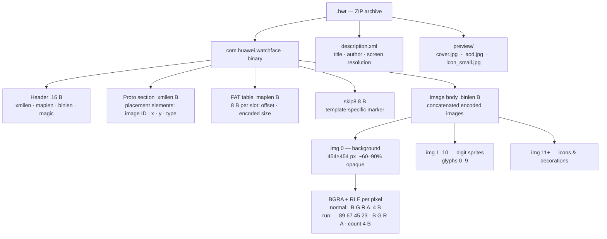

# hwt-gt2e — Huawei GT2e Watchface Toolkit

Build custom watchfaces for the **Huawei Watch GT 2e** (and likely GT2 / GT Runner variants)
from any image, using only open-source tools.

---

## What it does

- **Build** a `.hwt` watchface from any photo or image in seconds
- **View** an existing `.hwt` — extract all images and render a contact sheet
- **Inspect** the binary layout (proto header, FAT, image table)
- **Push** directly to your phone via ADB + [Gadgetbridge](https://codeberg.org/Freeyourgadget/Gadgetbridge)

The tool reverse-engineered the HWT binary format entirely from scratch — see
[`docs/WATCHFACE_RESEARCH.md`](docs/WATCHFACE_RESEARCH.md) for full format documentation.

---

## Requirements

```
python 3.8+
Pillow         pip install pillow
adb            (only needed for push)
Gadgetbridge   (on the phone — for installing .hwt files)
```

---

## Quick start

```bash
# Build a watchface from an image
python hwt.py build photo.jpg --name MyFace

# Also push to phone immediately
python hwt.py build photo.jpg --name MyFace --push

# Inspect an existing .hwt
python hwt.py info existing.hwt

# Extract all images from a .hwt + render contact sheet
python hwt.py view existing.hwt

# Push an existing .hwt
python hwt.py push watchfaces/MyFace.hwt
```

Output `.hwt` is written to `watchfaces/` by default.

---

## How it works

A `.hwt` file is a **ZIP** containing:

| Entry | Description |
|---|---|
| `com.huawei.watchface` | Binary blob: 16-byte header + XML proto + FAT + 8-byte skip marker + image body |
| `description.xml` | Title, author, screen resolution metadata |
| `preview/cover.jpg` | Thumbnail shown in Gadgetbridge app |
| `preview/aod.jpg` | AOD thumbnail (UI only — has no effect on watch AOD behavior) |



Images inside the body use a simple **BGRA + RLE** format. The toolkit decodes/encodes
these entirely without any Huawei SDK.

The `build` command:
1. Opens `templates/Carrera.hwt` as the template (keeps digit sprites, icons, proto structure)
2. Detects the background image(s) by opacity threshold (≥60% opaque, ≥100px)
3. Replaces them with your image (resized + circular-cropped)
4. Applies progressive compression to stay under the firmware's ~690 KB encoded limit:
   - Color channel snapping (rounds RGB to multiples of N — no blur, sharpness preserved)
   - JPEG de-noise + color snapping (kills photo noise while keeping edges)
   - Light Gaussian blur (last resort only)
5. Patches the FAT offsets in the proto header
6. Writes the new `.hwt`

---

## Templates

| File | Style | Notes |
|---|---|---|
| `templates/Carrera.hwt` | Bold digits, classic layout | Default |
| `templates/SimpleItalic.hwt` | Italic digits, minimal | Use with `--template` |

```bash
python hwt.py build photo.jpg --name MyFace --template templates/SimpleItalic.hwt
```

Templates contain no proprietary Huawei ROM assets. The template determines
which digit font and icon set appear on the watchface. **You can use any `.hwt`
as a template** — the community has hundreds of digit styles and layouts available
on sites like [AmazFit Watchfaces](https://amazfitwatchfaces.com/gt2/),
[faces4watch](https://faces4watch.com), and various Telegram watchface channels.
Download any `.hwt`, pass it via `--template`, and your image becomes the background
while that face's number style and icons are preserved.

---

## Push / install

Pushing requires ADB connected (USB or wireless). Two install targets are supported:

### Huawei Health (recommended)

No third-party apps needed — uses the official Huawei companion app.

```bash
python hwt.py push watchfaces/MyFace.hwt --via huawei-health
# or combined with build:
python hwt.py build photo.jpg --push --via huawei-health
```

The script copies the file to `/sdcard/Huawei/Themes/` and opens Huawei Health.
On the phone: **Watchfaces → Mine → ADD WATCH FACES** → select the file.

### Gadgetbridge (default)

Open-source alternative. Requires [Gadgetbridge](https://codeberg.org/Freeyourgadget/Gadgetbridge)
installed and watch paired.

```bash
python hwt.py push watchfaces/MyFace.hwt
# or:
python hwt.py push watchfaces/MyFace.hwt --via gadgetbridge
```

Copies to Gadgetbridge's data directory and opens the installer activity — tap **Install**.

---

## Research notes

See [`docs/WATCHFACE_RESEARCH.md`](docs/WATCHFACE_RESEARCH.md) for:

- Full HWT binary format spec
- Proto header layout
- RLE encoding details
- FAT structure and patching
- Firmware encoded-size limits (and why they exist)
- AOD investigation (why third-party AOD doesn't work on GT2e)
- skip8 marker variability across template families

---

## Limitations

- Only tested on **Huawei Watch GT 2e** (454×454 round display)
- **Template-based approach**: the tool replaces the background of an existing `.hwt` rather
  than authoring a watchface from scratch. Digit positions, icon placements, and UI layout are
  all inherited from the template — you can't freely reposition elements or add new ones without
  reverse-engineering and hand-editing the protobuf section
- AOD (Always-On Display) is controlled by Huawei's closed firmware — third-party faces
  can only do "pseudo-AOD" via mode switching, not real hardware AOD
- The `push` command uses Gadgetbridge's file installer; direct OTA is not implemented
